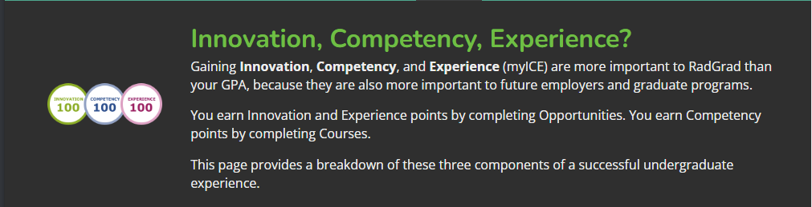

### Rad Grad for everybody          

After spending some time with Rad Grad, I was able to discover many opportunities that I was never aware of. Coming into the Computer Science degree a little after my first year of college, I had no clear goals in mind throughout my journey at UH. However, having something like Rad Grad lay out all of your options and challenges to level up your skill set before going out to the work field felt very reassuring. Rad Grad is a definitely a powerful tool that should be available to not just ICS students, but for anyone trying to gain something special that stands out from the others, something other than GPA. 

### What is my Rad Grad?

As a third year Computer Science student, I currently have no plans on going into a job relating to software development neither computers pretty much. Looking back at my high school years and my first year at UH, I probably had no idea what I was doing. I chose my previous major without having any real thought behind it thinking it would somehow work out. I ended up changing majors at the end of the first year because I knew that it's better to be early with this kind of decision. Speaking as of now I'm glad I made the decision I made and despite I had an knew that the skills I develop as I proceed my new studies as a Comp Sci student might not directly be useful for my future job, It definitely will become a speciality when going into the work force. 

  

One feature of Rad Grad that I thought was compelling was the statistical representation of the student experience in three categories Innovation, Competency, and Experience. In the course plan, we added some opportunities found in the list provided by Rad Grad and each of them consists of points for one or more categories based on the properties of that certain experience. Even if I don't end up using Rad Grad in the future, having a balanced experience as a undergraduate is a plus for any path I end up taking.

