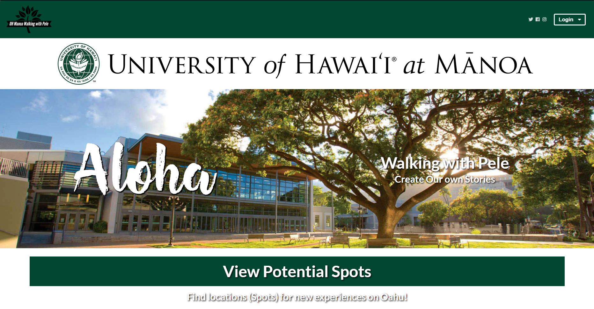
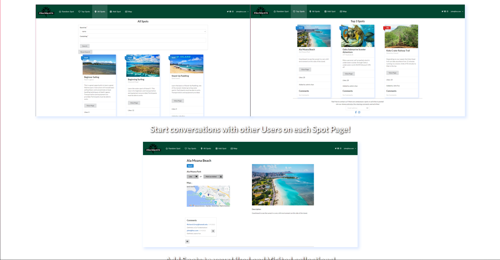

  
  

Walking with Pele is a web application made using Meteor and Semantic UI framework that my group created for our final project. It organizes and introduces activities that can be done on Hawaii for new and incoming UH students. We used issue driven project management to organize our code building progress. An issue will have a simple task like "implement mockup for home page" for example. One person will be assigned to this task and all of the work will be done in its own copy of the master code, this is so that we do not accidentally mess up what we already created and to not overwrite a code that some other team member is working on at the same time.  

My main contribution to the application was the user profile and the individual spots page. In the user profile page, It lists all the information of the current user that is logged in including a profile picture. Below that, there are two lists "Visited Spots" and "Liked Spots". As the name suggests, if spot A is listed in the visited spots list, It means that the user has marked the spot as "Visited" which can be done in the individual spots page. Every spot that is in the spots database has its own spots page. It contains all of the information for the spot such as address, number of likes, map funciton, etc. I had the most trouble with accessing the database values. There were times where I wanted an array of all the spots and at times where I just wanted one or just the spots that are liked. For reasons like this, I was able to grasp a better understanding of databases and how they are distributed within a web application. I'm certainly proud for what we created and am thankful for my teammates.
