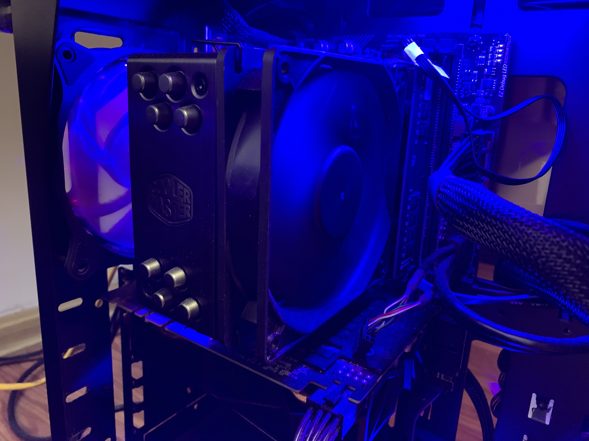

  

I have always been a kid who loves to play video games. The first computer game I played that I can remember is minecraft back when I was a middle schooler. The reason I was able to play minecraft when I had basically no allowance at that time was because a friend let me "borrow" his 2nd account. I still remember the account name "wizardcow" with some random number behind it which if I remember correctly was 32. Anyways as time went by I was a highschooler and at that moment of my life I was immensely into fortnite. I was luckily working part time and had the money so I decided to get myself a gaming pc to step up my game. 

Having almost no prior knowledge to building pc's, I watched all the youtube videos I can and made sure that all of my parts would be compatible. As soon as all of my part arrived, I put on my anti static electricity gloves and worked till the sun went down. The biggest problem that I faced was after I had everything set up and ready to go. I noticed that a high-spec gaming pc doesnt make my gameplay much better.  After all the money spent, I was not much different than when I was playing on my old HP laptop. All jokes aside, one issue that I later had is that the power supply was a little weak for my build and caused some blackouts until I replaced it with something better. This was a great experience that it taught me to learn to something from zero knowledge and to accomplish it with my own hands.
